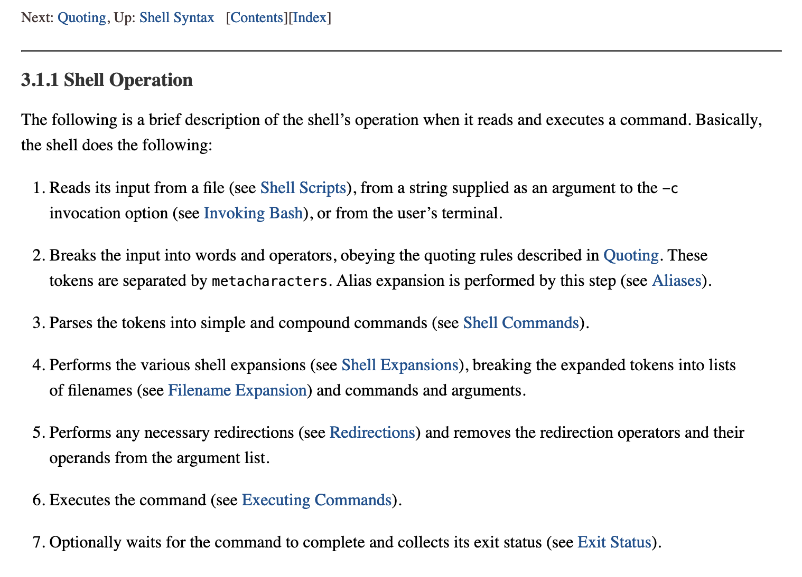

# 42Minishell

The objective of this project is for you to create a simple shell. 
Minishell is developed and tested on macOS and UNIX/LINUX systems. 

## Shell Operation


## Installation

* `git clone git@github.com:MLeganes/42Minishell.git`
* `cd 42Minishell`

## Running Minishell
 
* `make`

* Run program with ``` ./minishell```
  
## Dependencies

To run this proyect is needed the GNU Readline Library. Install it in macOS using the Package Manager [Homebrew](https://brew.sh/)

### Homebrew for macOS

Installing:

	rm -rf $HOME/.brew && git clone --depth=1 https://github.com/Homebrew/brew $HOME/.brew && echo 'export PATH=$HOME/.brew/bin:$PATH' >> $HOME/.zshrc && source $HOME/.zshrc && brew update

### GNU Readline Library

* [GNU-readline](https://tiswww.case.edu/php/chet/readline/rltop.html)

Installing in MacOS with Homebrew:

	brew install readline

Installing in Linux:

	sudo apt-get install libreadline-dev 

For compilers, include in Makefie:
	export LDFLAGS="-L$(HOME).brew/opt/readline/lib"
	export CPPFLAGS="-I$(HOME).brew/opt/readline/include"

## Tester
To run the general test:

	cd /tests
	bash tester.sh m

To run my test cases:
	
	cd /tests
	bash tester.sh -f cmds/mand/0_mand.sh

## Dockers and Valgrind

 [42toolbox](https://github.com/alexandregv/42toolbox)
 [guide](https://www.gungorbudak.com/blog/2018/06/13/memory-leak-testing-with-valgrind-on-macos-using-docker-containers/)

### Dockerfile

	FROM ubuntu:16.04
	RUN apt-get update
	RUN apt-get upgrade -y
	RUN apt-get install g++ valgrind -y
	RUN apt-get install libreadline6 libreadline6-dev
	RUN apt-get update && apt-get install make

### Build docker in 42toolbox

	docker build -t memory-test:0.1 .

### Run docker in project folder

	docker run -ti -v $(PWD):/test memory-test:0.1 bash -c "cd /test/; make && valgrind --leak-check=full --show-leak-kinds=all ./minishell; rm -f ./minishell"

## Links

* [GNU manual](https://www.gnu.org/savannah-checkouts/gnu/bash/manual/)
* [GNU readline](https://tiswww.case.edu/php/chet/readline/rltop.html)
* [System Programming](https://www.cs.purdue.edu/homes/grr/SystemsProgrammingBook/Book)
* [Writing your own shell](https://www.cs.purdue.edu/homes/grr/SystemsProgrammingBook/Book/Chapter5-WritingYourOwnShell.pdf)
* [shell syntax](https://pubs.opengroup.org/onlinepubs/009695399/utilities/xcu_chap02.html)
